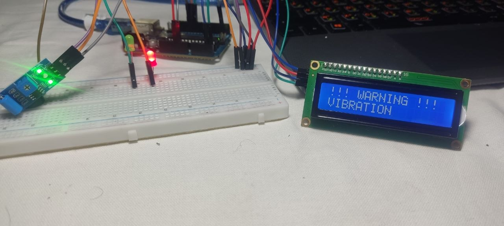
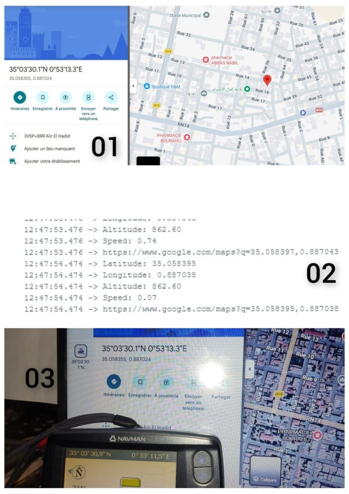
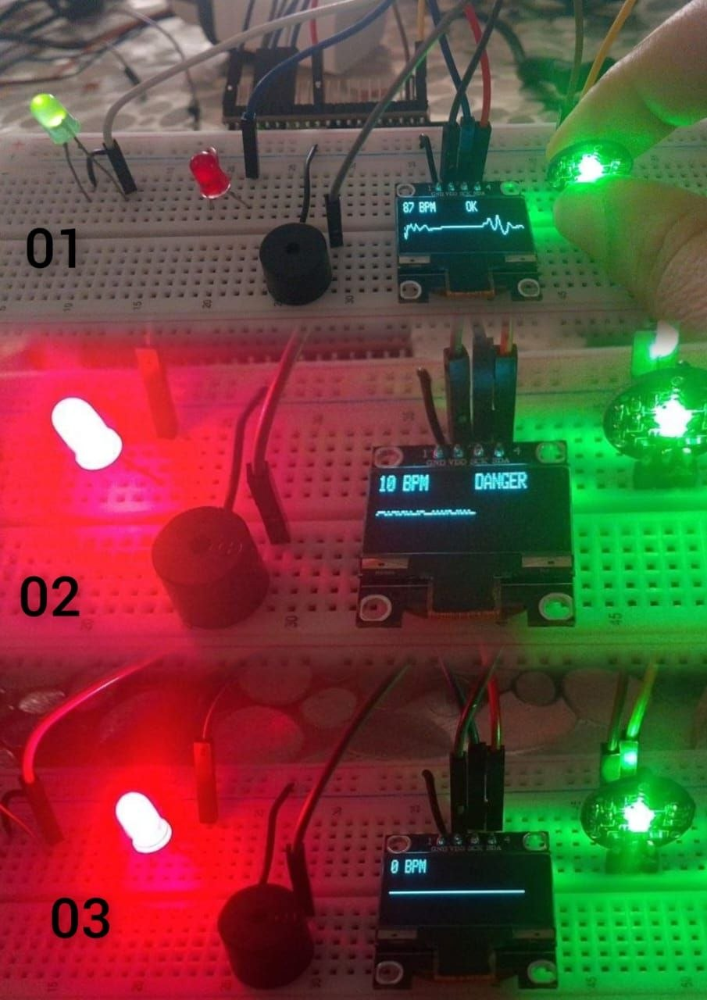

# index.html1
<!DOCTYPE html>
<html lang="fr">
<head>
    <meta charset="UTF-8">
    <meta name="viewport" content="width=device-width, initial-scale=1.0">
    <title>Projet de Fin d'Études | Houria & Rachida Mourad</title> 
    
</head>
<body>

<header>
    
    <h1>Université Mustapha Stambouli de Mascara</h1>
    
Faculté de Technologie / Département d'Électrotechnique

</header>

    <h2>Fiche Technique du Projet</h2>
    

        
Titre du Projet:

        
Conception et Réalisation d’un Système Intelligent de Détection d’Incidents Dangereux Monté sur un Drone

        
        
Réalisé par:

           
Houria Mourad  

        
Réalisé par:

           
Rachida Mourad  

        
        
Niveau:

           
2ème Année Électronique

        
        
Encadré par:

           
Mourad Hebali

        
        
Année Universitaire:

              
2026 - 2027

    <h2>Description du Projet (Résumé)</h2>
    

        هذا المشروع يهدف إلى تصميم نظام مدمج يعتمد على حساسات  محمول على درون للكشف عن المخاطر مثل الحرائق وتسرب الغازو كوارث الطبيعية  بشكل آلي وسريع، باستخدام تقنيات ESP32S3 وArduino uno  .
    

    <h2>Galerie Photos du Projet</h2>
     

    

        
        
Drone Finalisé (Vue d'ensemble)

    

    

         
        
Schéma Électronique (Circuit)

    

    

        
          
           
        
Test des capteurs

    

        

    <h2>Technologies Clés Utilisées</h2>
    <ul class="tech-list">
        <li class="tech-tag">ESP32-S3</li>     <li class="tech-tag">Arduino Uno</li>         <li class="tech-tag">ESP32-CAM</li>                 <li class="tech-tag">Capteur MQ2</li
        <li class="tech-tag">DHT22</li>        <li class="tech-tag">Capteur de pluie</li>    <li class="tech-tag"> Capteur Niveau de l'eau</li>   <li class="tech-tag">Buzzer</li>
        <li class="tech-tag">Capteur de Flamme</li>  <li class="tech-tag"> L'écran lcd</li>   <li class="tech-tag">L'écran oled</li>             <li class="tech-tag">led Rouge et vert </li>
        <li class="tech-tag">GPS </li>              <li class="tech-tag">Sim900 </li>         <li class="tech-tag">Servo Moteur </li>
        <li class="tech-tag">Capteur Bmp180</li>     <li class="tech-tag">Capteur Esp8266/li   <li class="tech-tag">Capteur vebrasion </li>
     </ul>

    &copy; 2026 Houria Mourad & Rachida Mourad - Faculté de Technologie - Mascara

</body>
</html>
